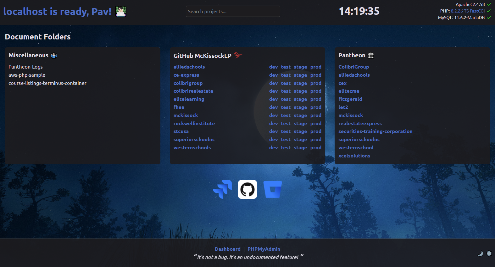

# Custom XAMPP/WAMP localhost index page
An informative custom XAMPP/WAMP localhost index page that displays your current projects, useful statistics and provides handy links.
Technically this localhost index can be adapted to suit any other local apache development environment. I've attempted to add cross-platform logic so that it works on both Windows and Linux platforms.

Please feel free to fork and make your own changes!

## Features:

- Search functionality for all local project folders specified
- Real-time clock
- Displays the current version of Apache, PHP and MySQL
- System stats using AJAX showing CPU Load, Memory Usage and Disk Space
- Button toggle to display the Apache error log
- Mac OS X style dock with links to relevant web-sites
- Modern responsive look
- Theme switcher for light and dark
- Peace of mind 🧘 (hopefully!)

## How to install:

1. Clone this repo to a location on your hard disk, e.g. `C:/xampp/htdocs/`
2. Run `npm install` in the repo's location to install dev dependencies
3. Update the `config.php` with your local MySQL login credentials, Apache and HTDOCS path
4. Modify the PHP script inside each column to suit your needs
5. Customise to your delight
6. Run `npm run build` to compile any changed SCSS or JavaScript
7. To disable the Apache error log or System stats, change the boolean values in `config.php`