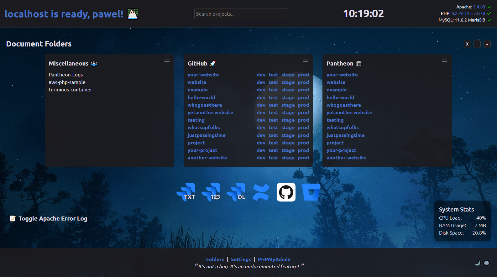
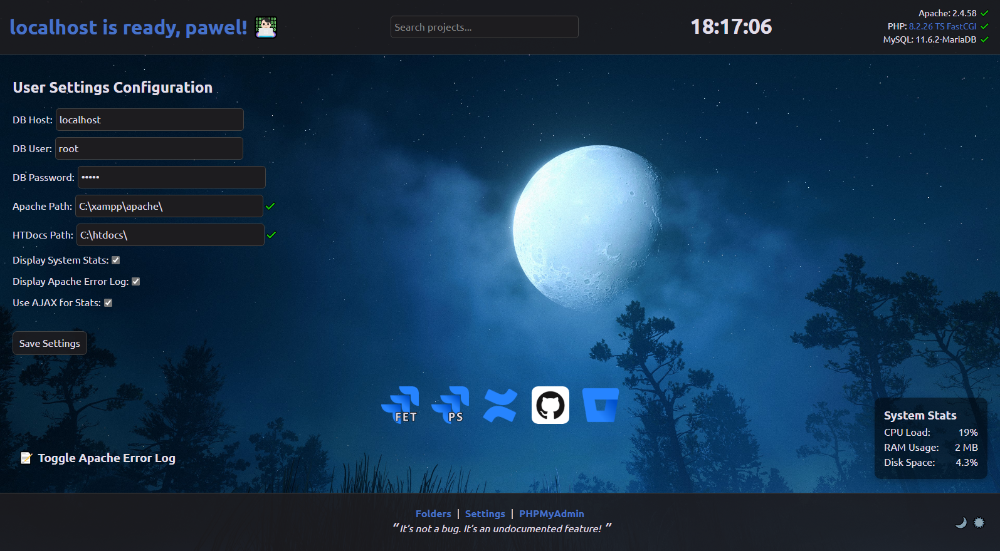
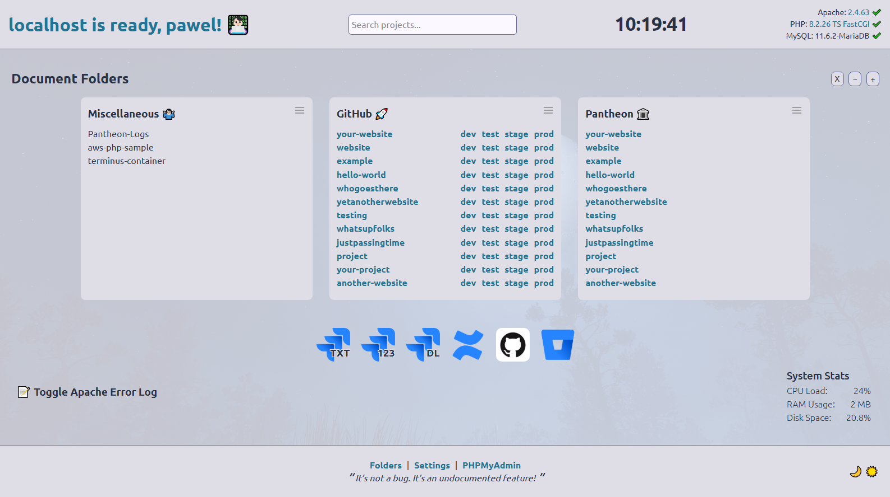

# 👨🏻‍💻 Custom XAMPP/LAMP/MAMP Localhost Index Page

An informative and fully modular custom local homepage for xAMP stacks (Apache, MySQL, PHP). This locahost index page showcases your projects, displays system stats, and provides admin tools — all now powered by a modern Webpack build process. Technically this can be adapted to suit any local Apache PHP development environment.

✅ Requires **PHP 8.0+**  
✅ Works on **Windows, macOS, and Linux**  
✅ Built with **Webpack, Babel, Sass, and module-based JS**

It is intended to be used with AMP stacks such as:

- [XAMPP](https://www.apachefriends.org/)
- [AMPPS](https://ampps.com/)
- [LAMP](https://www.digitalocean.com/community/tutorials/how-to-install-lamp-stack-on-ubuntu)
- [MAMP & MAMP PRO](https://www.mamp.info/)

Please feel free to fork and make your own changes!

## 📋 To-do

- Start/stop Apache
- UI to configure project folders

## 📚 Table of Contents

- [✨ Features](#-features)
- [🛠️ How to Install](#-how-to-install)
- [📸 Screenshots](#-screenshots)
- [📁 Project Structure](#-project-structure)

## ✨ Features

- Live search functionality for all local project folders
- Resizable and draggable columns
- Real-time clock
- Displays the current version of Apache, PHP and MySQL
- AJAX-powered system stats showing CPU Load, Memory Usage and Disk Space
- Configuration page for quick and easy setup
- Toggle PHP error handling and logging
- Virtual Hosts List
- Button toggle to display the Apache error log
- Mac OS X style customizable dock with links to relevant web-sites
- Modern responsive look
- Theme switcher for light and dark
- Peace of mind 🧘 (hopefully!)

## 🛠️ How to Install

1. Clone this repo to a location on your hard disk, e.g. `C:/xampp/htdocs/`
2. Run `npm install` in the repo's location to install dev dependencies
3. Set your config
    - Update the default `config.php` with your local MySQL login credentials, Apache and HTDOCS path 
     — OR —
    - Set your custom user config by navigating to the Settings page in the footer
4. Modify the PHP code within `partials/folders.php` to suit your needs
5. Customise to your delight
6. Run `npm run build` to compile any changed SCSS or JavaScript

## 🖼️ Screenshots

## 🗂️ Project Structure

A quick overview of the core files and folders in this project, so you’re never left wondering what does what.

---

### 📄 Root Files

| File                     | Description |
|--------------------------|-------------|
| `ajax_apache_error_log.php` | Fetches and returns Apache error log entries via AJAX. |
| `ajax_system_stats.php`  | Provides live server stats (CPU, memory, disk) using AJAX. |
| `apache_error_log.php`   | Displays the Apache error log in a styled UI component. |
| `config.php`             | Default configuration including MySQL credentials and Apache paths. |
| `index.php`              | Main entry point. Displays the homepage with all widgets and layout. |
| `phpinfo.php`            | Outputs PHP environment details via `phpinfo()` — handy for debugging. |
| `system_stats.php`       | Backend logic for system stat readings, used by AJAX. |
| `user_config.php`        | Auto generated user-defined overrides saved from the settings UI. |
| `package.json`           | Lists build dependencies and Webpack/Babel/Sass configuration. |
| `webpack.config.js`      | Webpack build pipeline for JS and SCSS. |

---

### 🧩 Partials (`partials/`)

| File                     | Description |
|--------------------------|-------------|
| `dock.json`              | Stores dock layout and links in JSON format. |
| `dock.php`               | Renders the customizable macOS-style dock. |
| `folders.php`            | Dynamically scans and lists local project folders. |
| `footer.php`             | The shared footer, includes theme toggle and settings link. |
| `header.php`             | Shared `<head>` setup, includes all essential meta and scripts. |
| `info.php`               | Displays system information like PHP, Apache, and MySQL versions. |
| `settings.php`           | The settings interface for configuring paths, dock, and logs. |
| `submit.php`             | Handles the saving of user-configured settings. |

---

### 🛠️ JavaScript (`assets/js/`)

| File/Folder              | Description |
|--------------------------|-------------|
| `main.js`                | Webpack entry point — initialises all modules. |
| `modules/`               | Modular ES6 scripts (e.g. `clock.js`, `dock.js`, `columns.js`) |

---

### 🎨 SCSS (`assets/scss/`)

| File                     | Description |
|--------------------------|-------------|
| `_index.scss`            | Layout and style rules for the homepage. |
| `fonts.scss`             | Custom fonts used in the project. |
| `reset.scss`             | Basic reset for cross-browser consistency. |
| `style.scss`             | SCSS entry point that imports all partials. |

---

### 🔤 Fonts (`fonts/`)

| File                     | Description |
|--------------------------|-------------|
| `Ubuntu-Regular.woff2`   | Regular variant. |
| `Ubuntu-Bold.woff2`      | Bold variant. |
| `Ubuntu-Light.woff2`     | Light variant. |
| `Ubuntu-Medium.woff2`    | Medium variant. |
| `css2.css`               | `@font-face` rules for Ubuntu. |

---

Explore and customise — this project is made to be yours! 😎
