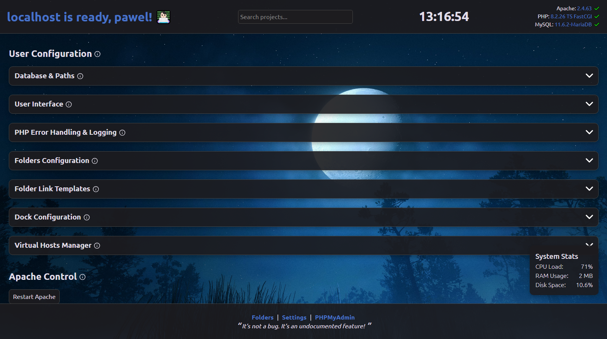

# 👨🏻‍💻 Custom XAMPP/LAMP/MAMP localhost index page
An informative custom xAMP (Apache MySQL PHP) stack localhost index page that displays your current projects, useful statistics and provides handy links. Requires PHP 8.0 or higher.
Technically this localhost index can be adapted to suit any other local Apache PHP development environment. I've added cross-platform logic so that it works on Windows, Linux and Mac platforms.

It is intended to be used with AMP stacks such as:

- [XAMPP](https://www.apachefriends.org/)
- [AMPPS](https://ampps.com/)
- [LAMP](https://www.digitalocean.com/community/tutorials/how-to-install-lamp-stack-on-ubuntu)
- [MAMP & MAMP PRO](https://www.mamp.info/)

Please feel free to fork and make your own changes!

## 📚 Table of Contents

- [✨ Features](#-features)
- [🛠️ How to Install](#️-how-to-install)
- [📸 Screenshots](#-screenshots)
- [📁 Project Structure](#-project-structure)

## ✨ Features

- Search functionality for all local project folders specified
- Resizable and draggable columns
- Real-time clock
- Displays the current version of Apache, PHP and MySQL
- System stats using AJAX showing CPU Load, Memory Usage and Disk Space
- Configuration page for quick and easy setup
- Toggle PHP error handling and logging
- Virtual Hosts List
- Button toggle to display the Apache error log
- Mac OS X style customizable dock with links to relevant web-sites
- Modern responsive look
- Theme switcher for light and dark
- Peace of mind 🧘 (hopefully!)

## 🛠️ How to Install

1. Clone this repo to a location on your hard disk, e.g. `C:/xampp/htdocs/`
2. Run `npm install` in the repo's location to install dev dependencies
3. Set your config
    - Update the default `config.php` with your local MySQL login credentials, Apache and HTDOCS path 
     — OR —
    - Set your custom user config by navigating to the Settings page in the footer
4. Modify the PHP code within `partials/folders.php` to suit your needs
5. Customise to your delight
6. Run `npm run build` to compile any changed SCSS or JavaScript

## 🖼️ Screenshots

## 🗂️ Project Structure

A quick overview of the core files and folders in this project, so you’re never left wondering what does what.

---

### 📄 Root Files

| File                     | Description |
|--------------------------|-------------|
| `ajax_apache_error_log.php` | Fetches and returns Apache error log entries via AJAX. |
| `ajax_system_stats.php`  | Provides live server stats (CPU, memory, disk) using AJAX. |
| `apache_error_log.php`   | Displays the Apache error log in a styled UI component. |
| `config.php`             | Default configuration including MySQL credentials and Apache paths. |
| `index.php`              | Main entry point. Displays the homepage with all widgets and layout. |
| `phpinfo.php`            | Outputs PHP environment details via `phpinfo()` — handy for debugging. |
| `system_stats.php`       | Backend logic for system stat readings, used by AJAX. |
| `user_config.php`        | Auto generated user-defined overrides saved from the settings UI. |

---

### 🧩 Partials (Modular Includes)

| File                     | Description |
|--------------------------|-------------|
| `partials/dock.json`     | Stores dock layout and links in JSON format. |
| `partials/dock.php`      | Renders the customizable macOS-style dock. |
| `partials/folders.php`   | Dynamically scans and lists local project folders. |
| `partials/footer.php`    | The shared footer, includes theme toggle and settings link. |
| `partials/header.php`    | Shared `<head>` setup, includes all essential meta and scripts. |
| `partials/info.php`      | Displays system information like PHP, Apache, and MySQL versions. |
| `partials/settings.php`  | The settings interface for configuring paths, dock, and logs. |
| `partials/submit.php`    | Handles the saving of user-configured settings. |

---

### 🛠️ JavaScript (`assets/js/`)

| File                     | Description |
|--------------------------|-------------|
| `script.js`              | Powers frontend features — dock interactions, themes, and AJAX. |

---

### 🎨 SCSS Styles (`assets/scss/`)

| File                     | Description |
|--------------------------|-------------|
| `fonts.scss`             | Defines any custom fonts used. |
| `reset.scss`             | Resets default browser styles for consistency. |
| `style.scss`             | Main stylesheet that imports all other partials. |
| `_index.scss`            | Styles for the homepage layout and core components. |

---

Explore and customise — this project is made to be yours! 😎
